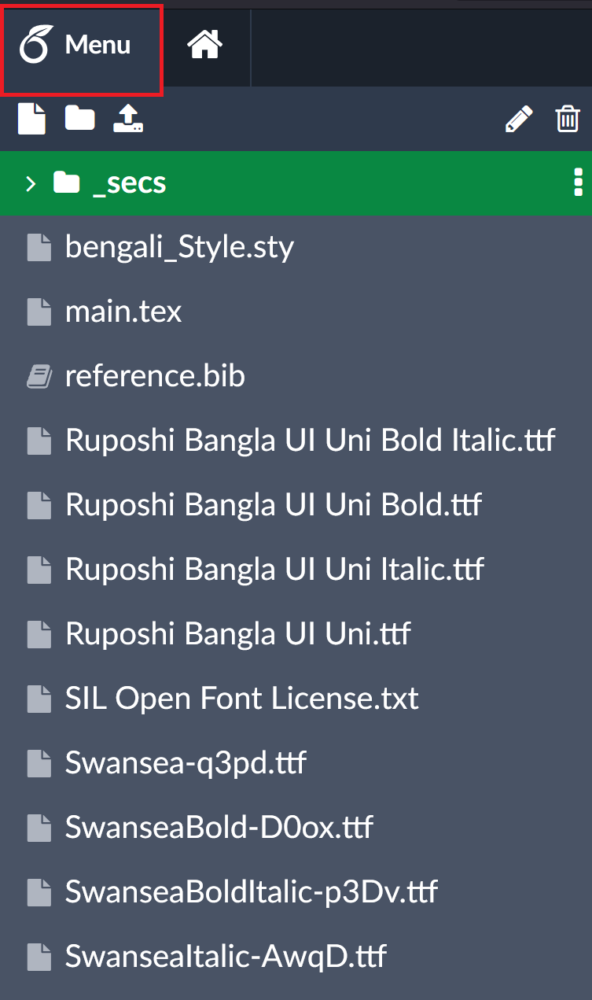
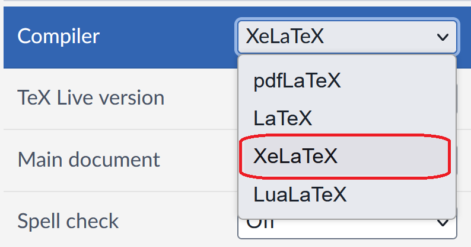

### Changing Compiler from Overleaf

- Sometimes for certain languages, classes and packages it may be necessary to use a different compiler like `xelatex` than the default `pdflaTex`. We have to set `XeLaTex` instead of PdfLatex for writing Bangla

- To change the compiler, simply click into the left hand menu: 

- Click on the Compiler menu under Settings , and select `XeLaTex`: 

### TODO: will add more features (work-in-progress)